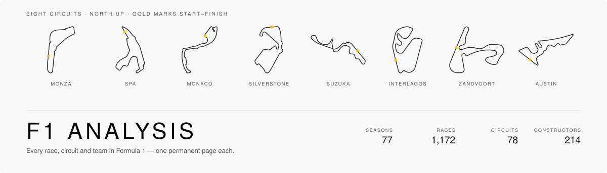

<div align="center">

<picture>
  <source media="(prefers-color-scheme: dark)" srcset="assets/banner-dark.svg">
  
</picture>

<br>


</div>

<br>

The 2026 Formula 1 season, circuit by circuit. Every round and every track gets one
designed page and one permanent URL, built from Formula 1's own timing feed — and
every race that has run can be replayed, car by car.

The opposite of a live-timing dashboard, deliberately.

<br>

## What's in it

| | |
|:--|--:|
| Rounds | 23 |
| Circuits | 23 |
| Teams | 11 |
| Drivers | 23 |
| Races you can replay | 14 |
| Circuits with official corner positions | 21 / 23 |

**Race replay.** Every completed round plays back from the timing feed — all 22 cars
at 2 Hz as coloured dots on the real circuit, the camera following the leader or any
car you pick from the running order. Pause, rewind, scrub, change speed. Running
order and lap counts come from where a car actually is on the track, not from how far
through its lap time it is, and each replay is scored against the starting grid, the
classified result and the lap count before it ships.

Cars in the pits or out of the race are drawn as outlines rather than discs. Monaco's
positions are missing from the feed almost entirely, so they are reconstructed from
speed — accurate to a median 17 m, and the replay says so on screen.

**Circuit pages** carry the track drawn from feed geometry, its official corners
highlighted along their full length, an unrolled curvature profile of the lap, and
where the circuit sits against the rest of the calendar for length and turn count.
A circuit has a start line and a finish line, and both are drawn where they are far
enough apart to tell apart — 8 of the 13 raced so far, from 101 m at Barcelona to
310 m at Monza. Melbourne, Monaco and Montreal paint one line and use it for both.

86 pages. The architecture still supports the full 1950–2026 archive — 1,172 races,
78 circuits, 1,520 pages — narrowed to one season by a single switch in
[`scope.ts`](site/src/lib/scope.ts); see [SPEC §4.3](Docs/SPEC.md).

## Data

Nothing here is measured by this site. Every figure is counted from data somebody
else gathered, and each source is named with what it actually supplies.

| Source | Licence | What it supplies |
|:--|:--|:--|
| [F1DB](https://github.com/f1db/f1db) | CC BY 4.0 | Results, standings, entities and career records, 1950–2026 |
| [OpenF1](https://openf1.org) | CC BY-NC-SA | Car positions, speed and lap timing — the replays — and team colours |
| [MultiViewer](https://multiviewer.app) | no terms published | Circuit geometry, official corner positions, finish lines |
| [TUMFTM](https://github.com/TUMFTM/racetrack-database) | LGPL-3.0 over ODbL | Centrelines where the feed has none. OpenStreetMap-derived |
| [bacinger/f1-circuits](https://github.com/bacinger/f1-circuits) | MIT | Outlines where neither covers — and this README's banner |
| Formula 1 media library · ESPN | **trademarks, no licence** | The constructors' marks, the championship's wordmark, the drivers' portraits and racing numbers, the cars |

The marks are trademarks of the constructors and of Formula One Licensing BV; the
portraits are photographs of people, and the cars photographs of a car carrying
its sponsors' marks — different things again. No licence covers any of them and
none is claimed; they are reproduced to say who is who, on a site that says on
its face that it is unofficial.

This is a personal, non-commercial project, which is what makes the NonCommercial
sources usable. Share-alike is **unresolved rather than met**, and said so plainly in
[the policy](Docs/knowledge/policies/source-roles.md); MultiViewer publishes no terms
at all, which is named rather than papered over. Attribution lives at
[`/credits/`](https://davidjcrawford.github.io/f1-analysis/credits/).

<br>

## Docs

The project is grounded in a spec and a knowledge base, both written before any code.

| | |
|:--|:--|
| [**SPEC.md**](Docs/SPEC.md) | Promise, scope, architecture, design system, risks, open decisions |
| [**RUNBOOK.md**](Docs/RUNBOOK.md) | Post-race ingest, triple-headers, failure playbooks |
| [**Knowledge base**](Docs/knowledge/index.md) | 78 concept documents in [OKF](https://github.com/GoogleCloudPlatform/open-knowledge-format) v0.2 — every source, metric and decision |

Findings were researched in parallel and then adversarially fact-checked. **83 of ~252
first-pass claims required correction** before anything was written down. Building it
corrected more, and those are recorded too — that a circuit has two start/finish lines
and the grid sits behind the *start* one, that the timing feed backfills so a cache is
never a final answer, and that an anomaly in data about a real event is worth a search
rather than a plausible-sounding story.

<br>

## Build

```bash
make data      # F1DB release -> canonical JSON -> geometry -> profiles -> colours
make replays   # race positions from the timing feed (slow first run, cached)
make verify    # score every replay against the grid, the result and the lap count
make build     # Astro build + Pagefind index
make preview
```

Every fetch is cached, so re-running costs nothing. `make verify` is the only gate
between a bad replay and the live site — pushing `main` deploys. Ingest runs locally
and its output is committed as data; see [RUNBOOK.md](Docs/RUNBOOK.md).

<br>

## Status

**Live**, at [davidjcrawford.github.io/f1-analysis](https://davidjcrawford.github.io/f1-analysis/).
86 pages build in under a second: the calendar and both championships, 23 circuits,
11 teams, 23 drivers, and 14 races you can replay.

Every replay is scored before it ships. Currently 8 of 14 reproduce the starting grid
exactly, 6 of 14 finish in the classified order, and zero have a car out of place
against the start line or a lap miscounted — the last two being faults rather than
tolerances.

Next: lap charts and race traces, the archival and timing tiers the scope switch
currently holds back, and the 3D that gave the spec its three.js section and has not
been written yet.

<br>

---

<div align="center">
<sub>

Unofficial and unaffiliated. Not associated with Formula 1, the FIA, or any team.<br>
F1, FORMULA ONE and related marks are trademarks of Formula One Licensing BV.

</sub>
</div>
